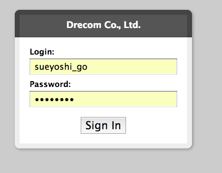
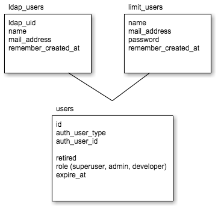
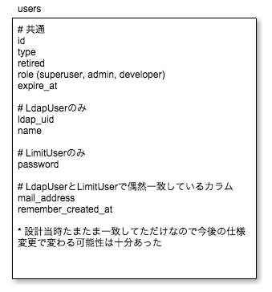
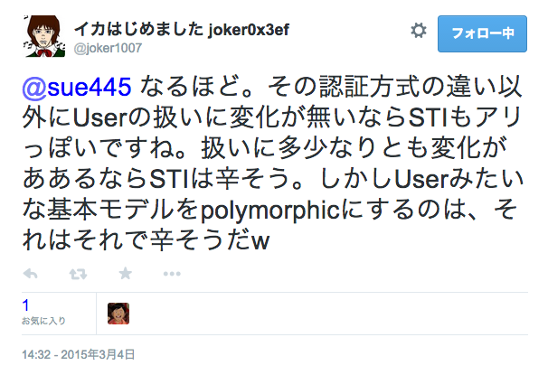

# 複数認証を例にしたポリモーフィックとSTIの設計紹介 #shibuyarb
sue445

2015/06/17 Shibuya.rb

---
## 自己紹介
[](https://twitter.com/sue445)

* [sue445](https://twitter.com/sue445)
* [株式会社ドリコム](http://www.drecom.co.jp/) 所属
* 社内ツールとか社内ライブラリとか
* TDDおじさん
* プリキュアおじさん

---
## 【今期の嫁】キュアトゥインクル


---
## 【本妻】キュアピース


---
## Agenda
* 前置き（やりたかったこと）
* ポリモーフィックとSTIでのそれぞれの設計
* ポリモーフィックでよかったこと (≒ STIのデメリット)
* ポリモーフィックでつらかったこと (≒ STIデメリット)
* まとめ
* おまけ（reveal.jsのこと）

---
## やりたかったこと
とある社内アプリの開発にて下記の要件があった

* 1ユーザで下記のいずれかの認証を利用
  * 普通の従業員であればLDAP認証
  * LDAPに紐付かないユーザ（常駐でない外部委託業者など）のでLDAP以外の認証
    * 今回はメアドとパスワード認証を採用
* 両方の認証を同時に利用するのは無し
* その他は特に指定なかったので Ruby2.2 + Rails4.2 で開発
  * サーバサイドエンジニアはみんなRails分かるので、Railsで書いておけば誰でもメンテできるだろという安心感

---

## 最初はdevise + omniauthでやろうとした
```ruby
class User < ActiveRecord::Base
  devise :omniauthable, :rememberable,
    omniauth_providers: [:ldap, :identity],
    authentication_keys: [:username]
end
```

一応これでやりたいことは実現できたが。。。

- - -
### できないことはないがomniauthがアレすぎて断念
* omniauthのデフォルトのフォームにはCSRFのtokenがないのでRailsでは使えない
* omniauthはrequestの`username`と`password`しか見ていないので `form_for` が使えない
  * `form_for` だと `user[username]` とかで渡ってくるので、usernameとpasswordちゃんと入力しても `missing_credentials` になる [参考](https://github.com/intridea/omniauth-ldap/blob/7aa1386881d47d54457e3bbe2485cc6a6daa889a/lib/omniauth/strategies/ldap.rb#L95)

- - -
### 【参考】古き良き時代を感じさせるomniauthのデフォルトフォーム


今風にbootstrap化しようにもrubyの中にHTMLがハードコーディングされてるのでハックするのは至難の業 [参考](https://github.com/intridea/omniauth/blob/v1.2.2/lib/omniauth/form.rb)

---
## 認証ごとにUserのModelを分けることにした
この2つがあればなんとかなるだろという最初の構想

* `LdapUser` : LDAP認証のユーザ
* `LimitUser` : パスワード認証のユーザ
  * パスワード認証のユーザはいろいろ機能制限されている仕様のため

- - -
### LdapUser
```ruby
class LdapUser < ActiveRecord::Base
  devise :ldap_authenticatable, :rememberable, authentication_keys: [:ldap_uid]

end
```

### LimitUser
```ruby
class LimitUser < ActiveRecord::Base
  devise :database_authenticatable, :recoverable, :rememberable, :validatable

end
```

---
## 【実現方法】ポリモーフィック vs STI
さてどうしよう？

* 選択肢
  * ポリモーフィック
  * STI (Single Table Inheritance)
* 先にネタバレすると今回はポリモーフィックを採用しました
  * 後述のSTIのコードやメリデメは設計段階に考えたものなので実際とは違うかもしれないです

---
## ポリモーフィック
複数のテーブルに分割する設計



usersがどっちのテーブルに紐づくかは `auth_user_type` と `auth_user_id` を見てRailsがいい感じに判断してくれる

- - -
### User
```ruby
class User < ActiveRecord::Base
  belongs_to :auth_user, polymorphic: true, dependent: :destroy
end
```

### LdapUser
```ruby
class LdapUser < ActiveRecord::Base
  devise :ldap_authenticatable, :rememberable, authentication_keys: [:ldap_uid]

  has_one :user, as: :auth_user
  after_create :create_user!
end
```

### LimitUser
```ruby
class LimitUser < ActiveRecord::Base
  devise :database_authenticatable, :recoverable, :rememberable, :validatable

  has_one :user, as: :auth_user
  after_create :create_user!
end
```

---
## STI
1つのテーブルに全部入りする設計



- - -
### User
```ruby
class User < ActiveRecord::Base
end
```

UserがどっちのModelに紐づくかは `type` を見てRailsがいい感じに判断してくれる

### LdapUser
```ruby
class LdapUser < User
  devise :ldap_authenticatable, :rememberable, authentication_keys: [:ldap_uid]
end
```

### LimitUser
```ruby
class LimitUser < User
  devise :database_authenticatable, :recoverable, :rememberable, :validatable
end
```

---
## Twitterで相談した
https://twitter.com/sue445/status/572987575595507712


- - -


- - -


- - -


- - -


---
## ポリモーフィックでよかったこと(≒ STIのデメリット)

- - -
### STIだと使わないカラムが必ず出てくる
* STIだとカラムにNOT NULL制約がつけられない
* ポリモーフィックだと使わないカラムがないのでNOT NULL制約がつけられる
* Rubyの世界できれいに解決できないならデータベースの世界できれいになる方を選んだ（ポリモーフィックを選んだ一番大きな理由）

---
## ポリモーフィックでつらかったこと(≒ STIのメリット)

- - -
### Model層はきれいに分離できたがController層にしわ寄せが。。。
application_controller.rb

```ruby
class ApplicationController < ActionController::Base
  def current_auth_user
    current_ldap_user || current_limit_user
  end

  def user_signed_in?
    ldap_user_signed_in? || limit_user_signed_in?
  end

  def signed_out_path
    case
    when current_user.ldap_user?
      destroy_ldap_user_session_path
    when current_user.limit_user?
      destroy_limit_user_session_path
    end
  end
end
```

- - -
### ポリモーフィックなModelのcontrollerをREST的に書くと冗長になる
routes.rb

```ruby
resources :users, only: [:index, :show, :edit, :update] do
  # userから見るとlimit_userは1つだけなので単数形
  resource :limit_users, only: [:edit, :update], path: :limit_user do
  end
end

# 全体から見るとlimit_userは複数あるので複数形
# limit_userとuserはセットで作る(作成時にはuser_idは存在しない)のでusersの外に出す
resources :limit_users, only: [:new, :create] do
end
```

上のroutesだとuserとlimit_userでフォームが分かれている

---
## まとめ
* 今回の場合はポリモーフィックでもSTIでもメリデメはそれぞれあったように思えるのでTPOで採用するのがいいと思う
* Model数やレコード数と要相談
  * 今回はModel 3つでユーザ数も数100くらいなのでどっちでもよかった
* 後からテーブル構成を変えるのは大変なので納得いくまでテーブル設計はしっかりしよう
  * 「『納得』は全てに優先するぜッ！」 by ジャイロ・ツェペリ ([SBR 8巻](http://www.amazon.co.jp/dp/4088741196)より)

---
## 【おまけ】このスライド作成のこと
* いつもはgoogle driveだけど [reveal.js](http://lab.hakim.se/reveal-js/) というのを使ってみた
* index.htmlにmarkdownを書いておくだけでjsがいい感じにスライドにできる

---
## 難点＆工夫点
index.htmlの中にmarkdownを書くのはエディタのシンタックスハイライトが効かないのがつらい

* template.html.erb + README.md -> index.html 変換をするRakefileを作った
* [guard-rake](https://github.com/rubyist/guard-rake) からrakeタスク実行
* README.mdを編集すれば自動でindex.htmlが作られるのでだいぶ快適になった
* 続きはgithubで！
